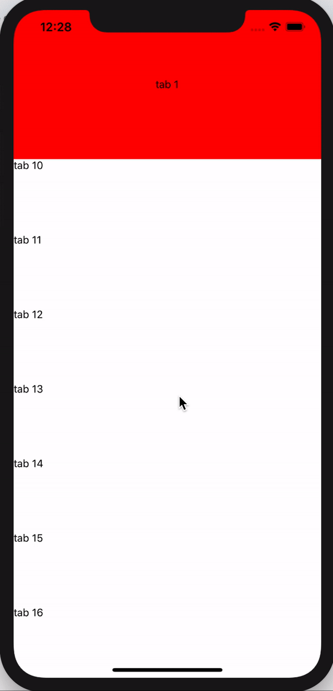

# react-native-parallax-scrollable-tab-view

# this is just an incomplete library

# Usage

```
import React from "react";
import { StyleSheet, Animated, View, Text } from "react-native";
import { ParallaxScrollableTabView } from "react-native-parallax-scrollable-tab-view";
import { ITab } from "react-native-parallax-scrollable-tab-view/lib/ScrollableTabView";

export const HEADER_OFFSET = 100;

export interface IProps {}

export interface IState {
  activeTabKey: string;
  tabs: ITab[];
}

export default class App extends React.Component<IProps, IState> {
  constructor(props) {
    super(props);

    this.state = {
      activeTabKey: "tab 1",
      tabs: [
        {
          key: "tab 1",
          title: "Tab 1"
        },
        {
          key: "tab 2",
          title: "Tab 2"
        }
      ]
    };
  }

  render() {
    const { activeTabKey, tabs } = this.state;

    return (
      <View style={styles.container}>
        <ParallaxScrollableTabView
          headerOffset={HEADER_OFFSET}
          renderHeader={({ offsetY }) => {
            return (
              <Animated.View
                style={{
                  opacity: offsetY.interpolate({
                    inputRange: [0, HEADER_OFFSET],
                    outputRange: [1, 0.5],
                    extrapolate: "clamp"
                  }),
                  alignItems: "center",
                  justifyContent: "center",
                  height: HEADER_OFFSET * 2,
                  backgroundColor: "red"
                }}
              >
                <Text>{activeTabKey}</Text>
              </Animated.View>
            );
          }}
          activeTabKey={activeTabKey}
          tabs={tabs}
          renderTab={({
            ref,
            tab,
            onScroll,
            onScrollBeginDrag,
            onScrollEndDrag,
            onMomentumScrollEnd
          }) => {
            return (
              <Animated.FlatList
                ref={ref}
                key={tab.key}
                style={{ flex: 1 }}
                contentContainerStyle={{
                  top: HEADER_OFFSET
                }}
                renderItem={({ item }) => {
                  return (
                    <View style={{ height: 100 }} key={item.key}>
                      <Text>
                        {tab.key}
                        {item.key}
                      </Text>
                    </View>
                  );
                }}
                onScroll={onScroll}
                onScrollBeginDrag={onScrollBeginDrag}
                onScrollEndDrag={onScrollEndDrag}
                onMomentumScrollEnd={onMomentumScrollEnd}
                data={[
                  { key: "0" },
                  { key: "1" },
                  { key: "2" },
                  { key: "3" },
                  { key: "4" },
                  { key: "5" },
                  { key: "6" },
                  { key: "7" },
                  { key: "8" },
                  { key: "9" },
                  { key: "10" },
                  { key: "11" },
                  { key: "12" },
                  { key: "13" },
                  { key: "14" },
                  { key: "15" }
                ]}
              />
            );
          }}
          onTabChange={({ tab }) => {
            this.setState({
              activeTabKey: tab.key
            });
          }}
        ></ParallaxScrollableTabView>
      </View>
    );
  }
}

const styles = StyleSheet.create({
  container: {
    flex: 1
  }
});

```

# Here is how it looks like


